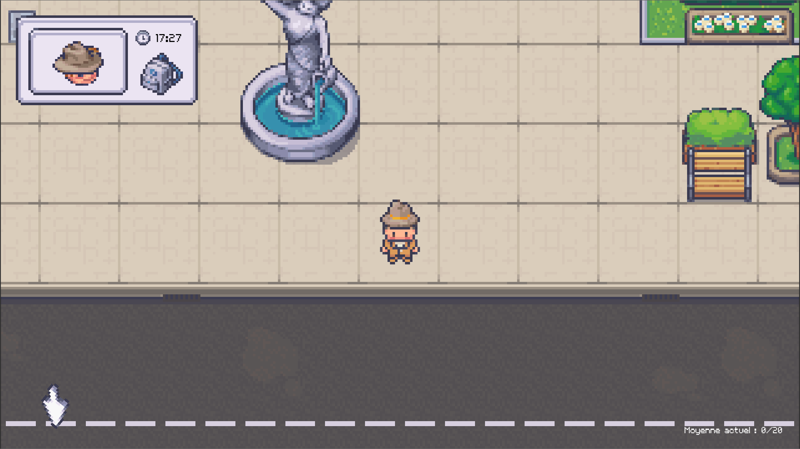
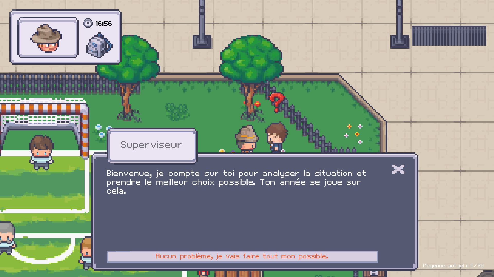
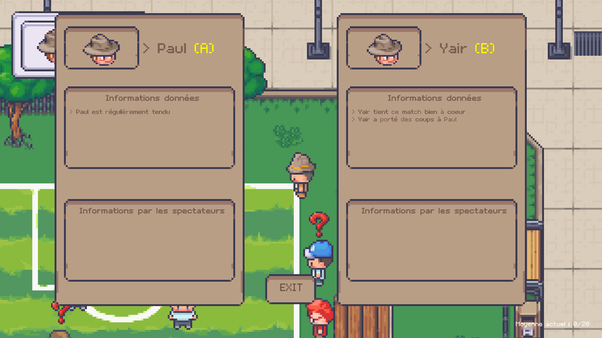
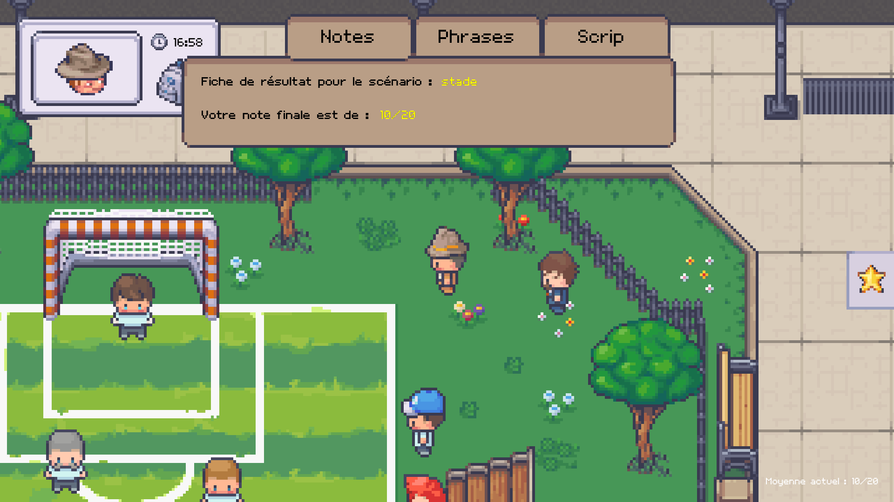

# 
Perception Of Violence

#### Participants :

- Ryan GOURDON
- Romain BOADE
- Yassin KIOUA

## Objectif pédagogique

Le joueur devra se rendre dans plusieurs scénarios où il devra résoudre divers conflits portant sur tous les types de violences possibles, tels que psychologiques, verbales, etc., et tout cela, à titre éducatif. L'objectif est de faire comprendre au joueur que chaque personne peut avoir une perception différente de la violence et que cela peut mener à des fins multiples.

## Type de jeu et mécanismes d'apprentissage

Dans ce jeu, le joueur incarne un enquêteur junior qui sera suivi par son superviseur. Il devra essayer de résoudre les différents conflits. Pour cela, il pourra discuter avec les personnes autour de lui dans la zone, utiliser les fiches que le superviseur lui donnera pour obtenir des premiers antécédents des protagonistes. Dès que le joueur se sentira prêt à régler le conflit, il pourra exprimer son opinion à son superviseur, et il pourra utiliser la méthode qui semble la meilleure au joueur pour régler ce conflit.

Le jeu se déroulera sous forme de trois scénarios (stade, bureau et salle de sport). À la fin de chaque scénario, le joueur obtiendra une note pour la gestion du conflit par rapport à la situation. La moyenne de ses notes lui permettra d'obtenir une note finale pour déterminer s'il sera admis ou refusé en tant qu'enquêteur.

Le joueur devra ainsi se faire sa propre perception de la situation et prendre en compte les émotions et relations qu'ont les personnes autour des protagonistes. Il devra donc essayer de discerner les vraies informations des fausses. Il aura plusieurs moyens de régler les conflits pour chaque situation et devra utiliser le plus adapté à la situation actuelle (demander des excuses, intervenir physiquement, etc.).

## Liste des principales fonctionnalités

- Plateforme de développement : **Godot**

### Fonctionnalité :

- [x] Choix aléatoire des cas de scénarios qui apparaissent
- [x] Résolution de conflit par choix
- [x] Fiche d'information par personnage principal
- [x] Lancement d'une partie
- [x] Système de note avec UI 
- [x] Compte rendu des choix par le superviseur
- [x] Bouton tutoriel
- [x] Menu principal
- [x] Menu dynamique
- [x] Gestion aléatoire des dialogues (NPC)
- [x] Fleche directionnel en fonction du scénario
- [x] Zoom Caméra possible
- [x] Possibilté de se battre si cas choisi
- [x] Menu Option

## Justification du choix de la Licence

Nous avons choisi la licence MIT pour notre jeu, "POV : Perception of Violence", axé sur la compréhension de la violence. Godot, l'éditeur que nous utilisons, est puissant et flexible grâce à cette licence, nous offrant la liberté de distribuer, utiliser et modifier le code source. Elle nous permet de développer le jeu de manière collaborative. En respectant les termes de la licence MIT, nous assurons la compatibilité avec Godot et préservons les droits de l'artiste qui fournit nos assets graphiques, tout en permettant à d'autres de contribuer au projet.

## Captures d'écran

### Capture d'écran du spawn avec flèche directionnel

### Capture d'écran discussion avec le superviseur

### Capture d'écran des fiches personnages

### Capture d'écran des notes

## Lien de téléchargement

Pour ouvrir le projet, il est nécessaire de posséder le logiciel et moteur de jeu Godot Engine, disponible ici en téléchargement : **[Godot Engine](https://godotengine.org/download)**

Vous pouvez cloner l'ensemble du [dépôt Git](https://github.com/yassinkioua/Jeu_serieux_POV)  ou si cela est plus pratique, vous pouvez également récupérer uniquement le code source en suivant [ce lien](./src) pour poursuivre le projet.
